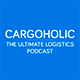
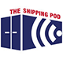
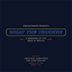

# Supply Chain and Logistics Podcasts

A collection of podcasts on Supply Chain and Logistics.

| Cover | Title | Website |
| :--- |:---| :--- |
|  | Aborn & Co | https://abornandcompany.podbean.com |
|  | Cargoholic | https://itunes.apple.com/us/podcast/cargoholic-the-ultimate-logistics-podcast/id1269441609 |
|  | Containers | https://soundcloud.com/containersfmg |
|  | ICC Logistics | https://itunes.apple.com/us/podcast/icc-logistics/id1021736846 |
|  | Inbound Logistics | http://www.inboundlogistics.com/cms/podcast |
|  | ISM Podcasts | https://www.instituteforsupplymanagement.org/Podcasts |
|  | JOC.com  | https://soundcloud.com/the-journal-of-commerce |
|  | LOGISTICS VIEWPOINTS | https://logisticsviewpoints.com/resources/webcasts/ |
|  | Next Level Purchasing Association Podcast | https://www.nextlevelpurchasing.com/supply-management-podcast |
|  | Manufacturing Talk Radio | http://mfgtalkradio.com |
|  | Shipping Podcast | http://shippingpodcast.com |
|  | Square One Supply Chain Podcast | https://www.investcalgaryregion.ca/square-one-supply-chain-podcast |
|  | Straight Talk With Supply Chain Insights | https://itunes.apple.com/us/podcast/straight-talk-supply-chain/id664901377 |
|  | Supply Chain and Logistics Management | https://itunes.apple.com/itunes-u/supply-chain-logistics-management/id447339850 |
|  | Supply Chain Radio | https://itunes.apple.com/de/podcast/supply-chain-radio/id983423048 |
|  | Supply Chain Secrets | http://www.logisticsbureau.com/podcasts/ |
|  | SupplyChainBrain | https://itunes.apple.com/us/podcast/the-supplychainbrain-podcast/id898142329 |
|  | Talking Logistics | https://talkinglogistics.com |
|  | The Loadstar | https://soundcloud.com/the-loadstar |
|  | The Shipping Pod | http://theshippingpod.libsyn.com |
|  | Triskele Logistics - CMI Podcast | https://soundcloud.com/user-380624060 |
|  | What The Truck?!? | https://www.freightwaves.com/podcasts |
|  | XPO Logistics Less-Than-Truckload | https://itunes.apple.com/us/podcast/xpo-logistics-less-than-truckload/id1095360303 |

## Single Episodes

* [The Empire Strikes Back (Asymcar by Horace Dediu, Epsiode #34)](http://5by5.tv/asymcar/34)  
Joe Rosmann shares his experience and perspective on our changing transportation system - "the most regulated industry we have".
* [With $50M Raised, He’s Leading Cargo Container Software Space (Nathan Latka)](http://nathanlatka.com/thetop733)  
In Episode #733, Nathan interviews Zvi Schreiber, founder and CEO of Freightos
* [Inside the secret shipping industry (Rose George, TED Talks)](https://www.ted.com/talks/rose_george_inside_the_secret_shipping_industry)  
Almost everything we own and use, at some point, travels to us by container ship, through a vast network of ocean routes and ports that most of us know almost nothing about. Journalist Rose George tours us through the world of shipping, the underpinning of consumer civilization.
* [Logistics Of War, Podcast 40 (Imperial War Museums)](http://www.iwm.org.uk/history/podcasts/voices-of-the-first-world-war/podcast-40-logistics-of-war)

## Credits

