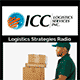
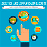

# Logistics Podcasts

A selection of podcasts on Supply Chain and Logistics.

| Cover | Title | Website |
| :--- |:---| :--- |
|  | Asymcar | http://5by5.tv/asymcar |
|  | Containers | https://soundcloud.com/containersfmg |
|  | ICC Logistics | https://itunes.apple.com/us/podcast/icc-logistics/id1021736846 |
|  | Inbound Logistics | http://www.inboundlogistics.com/cms/podcast |
|  | JOC.com  | https://soundcloud.com/the-journal-of-commerce |
|  | ISM Podcasts | https://www.instituteforsupplymanagement.org/Podcasts |
|  | LOGISTICS VIEWPOINTS | https://logisticsviewpoints.com/resources/webcasts/ |
|  | Manufacturing Talk Radio | http://mfgtalkradio.com |
|  | Square One Supply Chain Podcast | https://www.investcalgaryregion.ca/square-one-supply-chain-podcast |
|  | Straight Talk With Supply Chain Insights | https://itunes.apple.com/us/podcast/straight-talk-supply-chain/id664901377 |
|  | Supply Chain and Logistics Management | https://itunes.apple.com/itunes-u/supply-chain-logistics-management/id447339850 |
|  | Supply Chain Radio | https://itunes.apple.com/de/podcast/supply-chain-radio/id983423048 |
|  | Supply Chain Secrets | http://www.logisticsbureau.com/podcasts/ |
|  | SupplyChainBrain | https://itunes.apple.com/us/podcast/the-supplychainbrain-podcast/id898142329 |
|  | Talking Logistics | https://talkinglogistics.com |
|  | The Loadstar | https://soundcloud.com/the-loadstar |
|  | Triskele Logistics - CMI Podcast | https://soundcloud.com/user-380624060 |
|  | XPO Logistics Less-Than-Truckload | https://itunes.apple.com/us/podcast/xpo-logistics-less-than-truckload/id1095360303 |

## Single Episodes

* [With $50M Raised, He’s Leading Cargo Container Software Space (Nathan Latka)](http://nathanlatka.com/thetop733)  
In Episode #733, Nathan interviews Zvi Schreiber, founder and CEO of Freightos
* [Logistics Of War, Podcast 40 (Imperial War Museums)](http://www.iwm.org.uk/history/podcasts/voices-of-the-first-world-war/podcast-40-logistics-of-war)  

## Credits

Brought to you by:

